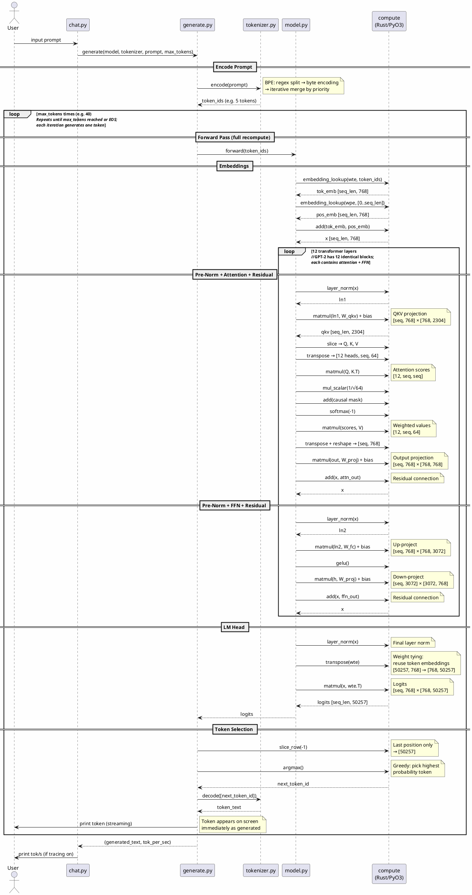

# Local LLM Inference Engine

A from-scratch implementation of GPT-2 inference, built for learning. Rust handles tensor math (via PyO3), Python handles everything else: tokenizer, transformer, generation, and CLI.

## Important Limitations

**This is an educational project, not a production system.** It is designed to teach how transformer-based language models work at every layer of the stack — from byte-pair encoding to matrix multiplication to autoregressive decoding.

Key limitations:

- **Extremely slow.** Even with AVX2 SIMD acceleration, generation runs at ~1–2 tokens/sec for GPT-2-124M. Without AVX2, it's ~0.05–0.1 tok/s. There is no KV cache — the full forward pass is recomputed for the entire sequence on every token.
- **No randomness.** Generation is greedy (argmax only) — it always picks the single most probable next token. This means output is deterministic but highly repetitive. There is no temperature, top-k, or top-p sampling.
- **No stop condition.** GPT-2 is a base model (not instruction-tuned), so it almost never predicts the end-of-text token during greedy decoding. Generation always runs until `--max-tokens` is reached.
- **Single-turn only.** Each prompt is independent — there is no conversation history or chat template.
- **F32 only.** No quantization (F16/I8). The full GPT-2-124M model uses ~500MB of memory.
- **CPU only.** No GPU or NPU offloading.

The objective is **clarity and correctness** — every component is tested against a golden-reference library (numpy, tiktoken, HuggingFace transformers) to prove it produces identical results.

## Architecture

```
┌─────────────────────────────────────────────────┐
│  chat.py  — CLI interface (single-turn)         │
├─────────────────────────────────────────────────┤
│  generate.py — autoregressive loop (greedy)     │
├─────────────────────────────────────────────────┤
│  model.py — GPT-2 transformer (12 layers)       │
├──────────────────┬──────────────────────────────┤
│  tokenizer.py    │  loader.py                   │
│  BPE encode/     │  safetensors parser +        │
│  decode          │  config loader               │
├──────────────────┴──────────────────────────────┤
│  compute (Rust/PyO3) — tensor math              │
│  AVX2+FMA SIMD with naive scalar fallback       │
└─────────────────────────────────────────────────┘
```

| File | Purpose | Lines |
|------|---------|-------|
| `compute/src/tensor.rs` | Tensor struct, all math ops, SIMD kernels | ~1000 |
| `compute/src/lib.rs` | PyO3 module, configuration API | ~55 |
| `tokenizer.py` | GPT-2 BPE encode/decode | ~170 |
| `loader.py` | Safetensors binary parser + config | ~100 |
| `model.py` | Full GPT-2 forward pass | ~230 |
| `generate.py` | Greedy decoding loop | ~165 |
| `chat.py` | Interactive CLI | ~165 |

## Inference Flow

The following sequence diagram shows the complete path from user prompt to generated response. Derived from actual `trace.log` output.

![Inference Flow](https://www.plantuml.com/plantuml/svg/jLVRRjj647tdLmpI5ygX95k-5IvSv5BR1HB7YkCa3x91hCWHjHMvot2NjjGFAFhSbmBzdVv9lgIpouifIs9KeBK1I-QUcJbxPcPt-49fbkayYHqruo9b6KjWp89PbCbSXAzbB3FuxlpC_3OG2h_aA0AyHALOX2zZ7Wa8K6ZC6gWCLIg5gb2lC9OFBxDCFe3ESdGS5cZo_b6H4Hbe7l2K2GtFWYdJlNJn39Y2r_HzUJL2WHdJM24kK2m3j9oXuBzYLY5kv6mPaSWGushrqlppX81CqbpZhN2lSwNxmyNLVgTWKomuZY4DtHyjFJW1sd6k8SreMJls6QqHCLggwBesg0SrEw_4Uv2mkMyVguxZd9x2cGW82qEx3AUdZcDSaKVQ27b4k-mMrXr7I8sGyMYgJ-3LyEo4P8zm3YgDkOQll_q1umK1h14NqQqmZxWsdFWzGe9PX0GXCbncN2yS4wHRqxUyV1ugSB4NzU0GQgQnb2dix3oo1yqJL3ix9VHWjtCh-lrhJ95f1RdGF6xibNYoO8eXK0sSNNtueTytQFEieYT5hPu2AR08tUyx3j0F2NKkimUMXJ1aYlXDyZWcfsNoEbOu0op5itcc7KqA8xVUMQVsTvQCCJGgAMDi7XP69j65LoD_1V99W5cUkWyQFMXuCtOLlDi8J12VZ654tUF7A3muFlh-RlimAOKPxVPwfVdTvaYfLFyY4Wkj6CR2gqmt-vu_zMgHPIti3QYrcL2aCHKMn6o16HM4IUp5yAOxW2ar4O5uI6S53rWCurW6CzLCVY25PfpgWsbjK5G5p-7y_5sLzp9NmmoxxoWCBRvi0AzHyJ0dnsK2D-pPClC5sRlpJWrSjzzOxBKvIfXEyjWbb0UV_I-p-mwH67EcQgDcVxv_yybq_IyO6BgtmaXPo0X__maZ-kB1O7_tuAwL4aLf964PluQYYdc0zYHuxy4R3pwrWMtwg0WAWn7bQeeiL1vOfaVjaKenJ9ZUJMUj0e-vKe6a2u8qs1kKtkbFk_iyzXKL3SlSlVxNt_ywEkYqmKrT1onNp9mwQjQALNAYwMXoktkji7A31NLISlqUFwFvf9FjdiNvyXQ_8U2Z-i_DxJbbQPc7kawsO2TpRMhHr5bhCLxbkhorMklnMr6Dp7FFTAlmAVHwIUgsfEuMHRJM4fzlwdKw2FwVBXzirUK3e-maQDNrOzejDLqlwFxkyQ1LqGZZtDsc3gTRvVad-I2UCh8SB2NpRUiaJoR_VOvHXFK5_FOIVgRZfkNsNKrfay8v5nJVOi1WDdcf-ynStgjkYWO6lQ3hz-HMP9YhSlXul9PDMn_k3WwFo_JQDhNvjKytthPbwaXC2bsTaitWRsN4jLfVEWtNQwlOcZRkXbKgzM1NO6lbR-pkFc1S9AxAG3axFRbCV9hXwwDoYJjJsemGtFgG8buKy-QeGMJ59SiYS_IkUhl84CC5ZJCycC6Kdg6Y0gPA7hCnf-bsKUHaHOvYWmBdsg_6icRaOeeEqKxHeoLOELEj6u4ruPfUx1l0YHcRwOsXg0rNQPff4ogErRqK-hAKPk7C3BDq_T7kwCZbIO8Xfn4tNfWtZ6hWfPwmZM6ZFRvekFMw9MJdJZ-bZb0OTEetZwVS-ZGTyucf-e38KNGQUL-GUthj-mS)

<details>
<summary>PlantUML source</summary>



</details>

## Setup

```bash
# Prerequisites: Python 3.12+, Rust 1.70+, maturin
cd llm
python -m venv .venv
source .venv/bin/activate

# Build the Rust tensor library
cd compute
maturin develop --release
cd ..

# Download GPT-2 124M model files (~550MB)
pip install huggingface_hub
python -c "
from huggingface_hub import snapshot_download
snapshot_download('openai-community/gpt2', local_dir='models/gpt2')
"
```

The download places `config.json`, `vocab.json`, `merges.txt`, `tokenizer.json`, and `model.safetensors` into `models/gpt2/`. The safetensors file (523MB) is excluded from git — each clone needs to download it.

## Usage

```bash
# Basic chat
python chat.py

# With tracing (log to file, show tok/s on console)
python chat.py --trace 1 --trace-file trace.log

# High verbosity trace (per-op shapes and timing)
python chat.py --trace 2 --trace-file trace.log

# Force naive scalar ops (disable SIMD, for benchmarking/debugging)
python chat.py --no-avx2

# All options
python chat.py --model-dir models/gpt2 --max-tokens 40 --trace 2 --trace-file trace.log --no-avx2
```

### Interactive Commands

| Command | Effect |
|---------|--------|
| `/quit` | Exit |
| `/trace 0\|1\|2` | Set trace verbosity (0=off, 1=low, 2=high) |
| `/avx2 on\|off` | Toggle SIMD acceleration at runtime |

### Trace Levels

- **Level 0**: No trace output.
- **Level 1 (low)**: Rust ops log `[compute] op_name (Xms)` to trace file. Python logs generation summary. Console shows tok/s after each response.
- **Level 2 (high)**: Rust ops additionally log input/output shapes. Python logs per-token top-5 candidates with probabilities.

Trace output goes to the log file only (not the console). Generated tokens are logged with `[generated_token]` prefix.

## Testing

```bash
pip install -r requirements-test.txt
python -m pytest tests/ -v
```

All 130 tests compare our implementation against golden-reference libraries:

| Test Suite | Golden Reference | Tests |
|-----------|-----------------|-------|
| `test_tensor.py` | numpy | 49 |
| `test_tokenizer.py` | tiktoken | 32 |
| `test_loader.py` | safetensors (Python lib) | 27 |
| `test_model.py` | HuggingFace transformers | 13 |
| `test_generate.py` | HuggingFace `model.generate()` | 9 |

## Project Goals

1. **Understand every layer** — from BPE merges to attention masks to SIMD intrinsics
2. **Correctness first** — every op matches its golden reference exactly
3. **Minimal dependencies** — runtime needs only the self-built `compute` crate; all ML libraries are test-only
4. **Read the code** — flat file layout, one concept per file, no frameworks or abstractions

See [plan.md](plan.md) for the full development plan and enhancement roadmap.
