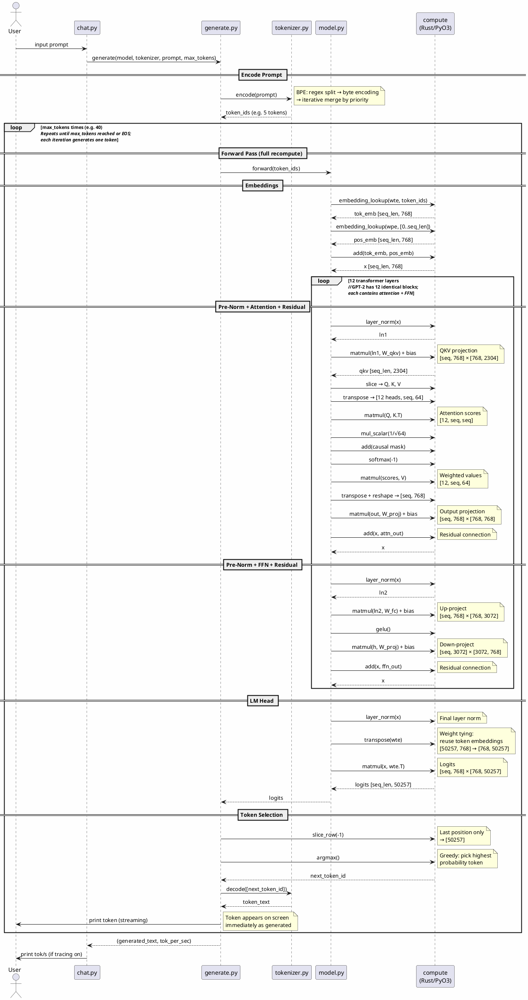

# Local LLM Inference Engine

A from-scratch implementation of GPT-2 inference, built for learning. Rust handles tensor math (via PyO3), Python handles everything else: tokenizer, transformer, generation, and CLI.

## Important Limitations

**This is an educational project, not a production system.** It is designed to teach how transformer-based language models work at every layer of the stack — from byte-pair encoding to matrix multiplication to autoregressive decoding.

Key limitations:

- **Extremely slow.** Even with AVX2 SIMD acceleration, generation runs at ~1–2 tokens/sec for GPT-2-124M. Without AVX2, it's ~0.05–0.1 tok/s. There is no KV cache — the full forward pass is recomputed for the entire sequence on every token.
- **No randomness.** Generation is greedy (argmax only) — it always picks the single most probable next token. This means output is deterministic but highly repetitive. There is no temperature, top-k, or top-p sampling.
- **No stop condition.** GPT-2 is a base model (not instruction-tuned), so it almost never predicts the end-of-text token during greedy decoding. Generation always runs until `--max-tokens` is reached.
- **Single-turn only.** Each prompt is independent — there is no conversation history or chat template.
- **F32 only.** No quantization (F16/I8). The full GPT-2-124M model uses ~500MB of memory.
- **CPU only.** No GPU or NPU offloading.

The objective is **clarity and correctness** — every component is tested against a golden-reference library (numpy, tiktoken, HuggingFace transformers) to prove it produces identical results.

## Architecture

```
┌─────────────────────────────────────────────────┐
│  chat.py  — CLI interface (single-turn)         │
├─────────────────────────────────────────────────┤
│  generate.py — autoregressive loop (greedy)     │
├─────────────────────────────────────────────────┤
│  model.py — GPT-2 transformer (12 layers)       │
├──────────────────┬──────────────────────────────┤
│  tokenizer.py    │  loader.py                   │
│  BPE encode/     │  safetensors parser +        │
│  decode          │  config loader               │
├──────────────────┴──────────────────────────────┤
│  compute (Rust/PyO3) — tensor math              │
│  AVX2+FMA SIMD with naive scalar fallback       │
└─────────────────────────────────────────────────┘
```

| File | Purpose | Lines |
|------|---------|-------|
| `compute/src/tensor.rs` | Tensor struct, all math ops, SIMD kernels | ~1000 |
| `compute/src/lib.rs` | PyO3 module, configuration API | ~55 |
| `tokenizer.py` | GPT-2 BPE encode/decode | ~170 |
| `loader.py` | Safetensors binary parser + config | ~100 |
| `model.py` | Full GPT-2 forward pass | ~230 |
| `generate.py` | Greedy decoding loop | ~165 |
| `chat.py` | Interactive CLI | ~165 |

## Inference Flow

The following sequence diagram shows the complete path from user prompt to generated response. Derived from actual `trace.log` output.

![Inference Flow](https://www.plantuml.com/plantuml/svg/~h407374617274756d6c0a736b696e706172616d206261636b67726f756e64436f6c6f7220234645464546450a736b696e706172616d2073657175656e63654d657373616765416c69676e2063656e7465720a736b696e706172616d20726573706f6e73654d65737361676542656c6f774172726f7720747275650a0a6163746f7220557365720a7061727469636970616e742022636861742e70792220617320436861740a7061727469636970616e74202267656e65726174652e7079222061732047656e0a7061727469636970616e742022746f6b656e697a65722e70792220617320546f6b0a7061727469636970616e7420226d6f64656c2e707922206173204d6f64656c0a7061727469636970616e742022636f6d707574650a28527573742f50794f33292220617320436f6d707574650a0a55736572202d3e2043686174203a20696e7075742070726f6d70740a43686174202d3e2047656e203a2067656e6572617465286d6f64656c2c20746f6b656e697a65722c2070726f6d70742c206d61785f746f6b656e73290a0a3d3d20456e636f64652050726f6d7074203d3d0a0a47656e202d3e20546f6b203a20656e636f64652870726f6d7074290a6e6f74652072696768743a204250453a2072656765782073706c697420e28692206279746520656e636f64696e670ae2869220697465726174697665206d65726765206279207072696f726974790a546f6b202d2d3e2047656e203a20746f6b656e5f6964732028652e672e203520746f6b656e73290a0a6c6f6f70202a2a6d61785f746f6b656e732074696d65732a2a2028652e672e203430290a2f2f5265706561747320756e74696c206d61785f746f6b656e732072656163686564206f7220454f533b2f2f0a2f2f6561636820697465726174696f6e2067656e657261746573206f6e6520746f6b656e2f2f0a0a202020203d3d20466f72776172642050617373202866756c6c207265636f6d7075746529203d3d0a0a2020202047656e202d3e204d6f64656c203a20666f727761726428746f6b656e5f696473290a0a202020203d3d20456d62656464696e6773203d3d0a202020204d6f64656c202d3e20436f6d70757465203a20656d62656464696e675f6c6f6f6b7570287774652c20746f6b656e5f696473290a20202020436f6d70757465202d2d3e204d6f64656c203a20746f6b5f656d62205b7365715f6c656e2c203736385d0a202020204d6f64656c202d3e20436f6d70757465203a20656d62656464696e675f6c6f6f6b7570287770652c205b302e2e7365715f6c656e5d290a20202020436f6d70757465202d2d3e204d6f64656c203a20706f735f656d62205b7365715f6c656e2c203736385d0a202020204d6f64656c202d3e20436f6d70757465203a2061646428746f6b5f656d622c20706f735f656d62290a20202020436f6d70757465202d2d3e204d6f64656c203a2078205b7365715f6c656e2c203736385d0a0a202020206c6f6f70202a2a3132207472616e73666f726d6572206c61796572732a2a0a2f2f4750542d3220686173203132206964656e746963616c20626c6f636b733b2f2f0a2f2f6561636820636f6e7461696e7320617474656e74696f6e202b2046464e2f2f0a0a20202020202020203d3d205072652d4e6f726d202b20417474656e74696f6e202b20526573696475616c203d3d0a20202020202020204d6f64656c202d3e20436f6d70757465203a206c617965725f6e6f726d2878290a2020202020202020436f6d70757465202d2d3e204d6f64656c203a206c6e310a20202020202020204d6f64656c202d3e20436f6d70757465203a206d61746d756c286c6e312c20575f716b7629202b20626961730a20202020202020206e6f74652072696768743a20514b562070726f6a656374696f6e0a5b7365712c203736385d20c397205b3736382c20323330345d0a2020202020202020436f6d70757465202d2d3e204d6f64656c203a20716b76205b7365715f6c656e2c20323330345d0a20202020202020204d6f64656c202d3e20436f6d70757465203a20736c69636520e2869220512c204b2c20560a20202020202020204d6f64656c202d3e20436f6d70757465203a207472616e73706f736520e28692205b31322068656164732c207365712c2036345d0a20202020202020204d6f64656c202d3e20436f6d70757465203a206d61746d756c28512c204b2e54290a20202020202020206e6f74652072696768743a20417474656e74696f6e2073636f7265730a5b31322c207365712c207365715d0a20202020202020204d6f64656c202d3e20436f6d70757465203a206d756c5f7363616c617228312fe2889a3634290a20202020202020204d6f64656c202d3e20436f6d70757465203a206164642863617573616c206d61736b290a20202020202020204d6f64656c202d3e20436f6d70757465203a20736f66746d6178282d31290a20202020202020204d6f64656c202d3e20436f6d70757465203a206d61746d756c2873636f7265732c2056290a20202020202020206e6f74652072696768743a2057656967687465642076616c7565730a5b31322c207365712c2036345d0a20202020202020204d6f64656c202d3e20436f6d70757465203a207472616e73706f7365202b207265736861706520e28692205b7365712c203736385d0a20202020202020204d6f64656c202d3e20436f6d70757465203a206d61746d756c286f75742c20575f70726f6a29202b20626961730a20202020202020206e6f74652072696768743a204f75747075742070726f6a656374696f6e0a5b7365712c203736385d20c397205b3736382c203736385d0a20202020202020204d6f64656c202d3e20436f6d70757465203a2061646428782c206174746e5f6f7574290a20202020202020206e6f74652072696768743a20526573696475616c20636f6e6e656374696f6e0a2020202020202020436f6d70757465202d2d3e204d6f64656c203a20780a0a20202020202020203d3d205072652d4e6f726d202b2046464e202b20526573696475616c203d3d0a20202020202020204d6f64656c202d3e20436f6d70757465203a206c617965725f6e6f726d2878290a2020202020202020436f6d70757465202d2d3e204d6f64656c203a206c6e320a20202020202020204d6f64656c202d3e20436f6d70757465203a206d61746d756c286c6e322c20575f666329202b20626961730a20202020202020206e6f74652072696768743a2055702d70726f6a6563740a5b7365712c203736385d20c397205b3736382c20333037325d0a20202020202020204d6f64656c202d3e20436f6d70757465203a2067656c7528290a20202020202020204d6f64656c202d3e20436f6d70757465203a206d61746d756c28682c20575f70726f6a29202b20626961730a20202020202020206e6f74652072696768743a20446f776e2d70726f6a6563740a5b7365712c20333037325d20c397205b333037322c203736385d0a20202020202020204d6f64656c202d3e20436f6d70757465203a2061646428782c2066666e5f6f7574290a20202020202020206e6f74652072696768743a20526573696475616c20636f6e6e656374696f6e0a2020202020202020436f6d70757465202d2d3e204d6f64656c203a20780a0a20202020656e640a0a202020203d3d204c4d2048656164203d3d0a202020204d6f64656c202d3e20436f6d70757465203a206c617965725f6e6f726d2878290a202020206e6f74652072696768743a2046696e616c206c61796572206e6f726d0a202020204d6f64656c202d3e20436f6d70757465203a207472616e73706f736528777465290a202020206e6f74652072696768743a20576569676874207479696e673a0a726575736520746f6b656e20656d62656464696e67730a5b35303235372c203736385d20e28692205b3736382c2035303235375d0a202020204d6f64656c202d3e20436f6d70757465203a206d61746d756c28782c207774652e54290a202020206e6f74652072696768743a204c6f676974730a5b7365712c203736385d20c397205b3736382c2035303235375d0a20202020436f6d70757465202d2d3e204d6f64656c203a206c6f67697473205b7365715f6c656e2c2035303235375d0a202020204d6f64656c202d2d3e2047656e203a206c6f676974730a0a202020203d3d20546f6b656e2053656c656374696f6e203d3d0a2020202047656e202d3e20436f6d70757465203a20736c6963655f726f77282d31290a202020206e6f74652072696768743a204c61737420706f736974696f6e206f6e6c790ae28692205b35303235375d0a2020202047656e202d3e20436f6d70757465203a206172676d617828290a202020206e6f74652072696768743a204772656564793a207069636b20686967686573740a70726f626162696c69747920746f6b656e0a20202020436f6d70757465202d2d3e2047656e203a206e6578745f746f6b656e5f69640a2020202047656e202d3e20546f6b203a206465636f6465285b6e6578745f746f6b656e5f69645d290a20202020546f6b202d2d3e2047656e203a20746f6b656e5f746578740a2020202047656e202d3e2055736572203a207072696e7420746f6b656e202873747265616d696e67290a202020206e6f74652072696768743a20546f6b656e2061707065617273206f6e2073637265656e0a696d6d6564696174656c792061732067656e6572617465640a0a656e640a0a47656e202d2d3e2043686174203a202867656e6572617465645f746578742c20746f6b5f7065725f736563290a43686174202d3e2055736572203a207072696e7420746f6b2f73202869662074726163696e67206f6e290a0a40656e64756d6c)

<details>
<summary>PlantUML source</summary>



</details>

## Setup

```bash
# Prerequisites: Python 3.12+, Rust 1.70+, maturin
cd llm
python -m venv .venv
source .venv/bin/activate

# Build the Rust tensor library
cd compute
maturin develop --release
cd ..

# Download GPT-2 124M model files (~550MB)
pip install huggingface_hub
python -c "
from huggingface_hub import snapshot_download
snapshot_download('openai-community/gpt2', local_dir='models/gpt2')
"
```

The download places `config.json`, `vocab.json`, `merges.txt`, `tokenizer.json`, and `model.safetensors` into `models/gpt2/`. The safetensors file (523MB) is excluded from git — each clone needs to download it.

## Usage

```bash
# Basic chat
python chat.py

# With tracing (log to file, show tok/s on console)
python chat.py --trace 1 --trace-file trace.log

# High verbosity trace (per-op shapes and timing)
python chat.py --trace 2 --trace-file trace.log

# Force naive scalar ops (disable SIMD, for benchmarking/debugging)
python chat.py --no-avx2

# All options
python chat.py --model-dir models/gpt2 --max-tokens 40 --trace 2 --trace-file trace.log --no-avx2
```

### Interactive Commands

| Command | Effect |
|---------|--------|
| `/quit` | Exit |
| `/trace 0\|1\|2` | Set trace verbosity (0=off, 1=low, 2=high) |
| `/avx2 on\|off` | Toggle SIMD acceleration at runtime |

### Trace Levels

- **Level 0**: No trace output.
- **Level 1 (low)**: Rust ops log `[compute] op_name (Xms)` to trace file. Python logs generation summary. Console shows tok/s after each response.
- **Level 2 (high)**: Rust ops additionally log input/output shapes. Python logs per-token top-5 candidates with probabilities.

Trace output goes to the log file only (not the console). Generated tokens are logged with `[generated_token]` prefix.

## Testing

```bash
pip install -r requirements-test.txt
python -m pytest tests/ -v
```

All 130 tests compare our implementation against golden-reference libraries:

| Test Suite | Golden Reference | Tests |
|-----------|-----------------|-------|
| `test_tensor.py` | numpy | 49 |
| `test_tokenizer.py` | tiktoken | 32 |
| `test_loader.py` | safetensors (Python lib) | 27 |
| `test_model.py` | HuggingFace transformers | 13 |
| `test_generate.py` | HuggingFace `model.generate()` | 9 |

## Project Goals

1. **Understand every layer** — from BPE merges to attention masks to SIMD intrinsics
2. **Correctness first** — every op matches its golden reference exactly
3. **Minimal dependencies** — runtime needs only the self-built `compute` crate; all ML libraries are test-only
4. **Read the code** — flat file layout, one concept per file, no frameworks or abstractions

See [plan.md](plan.md) for the full development plan and enhancement roadmap.
